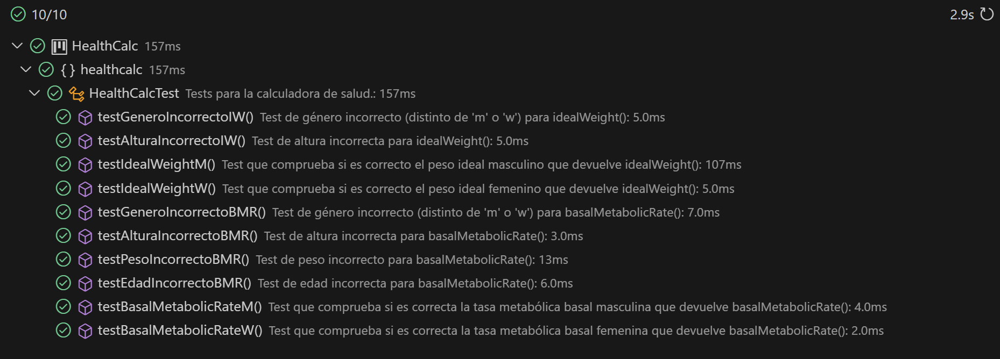
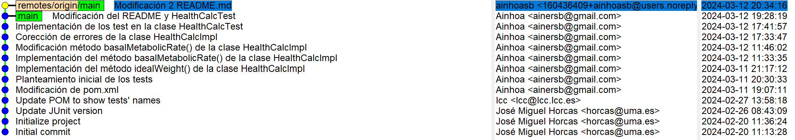

# Práctica 1 : Health calculator

En esta práctica se desarrolla una calculadora que permite estimar varios parámetros de salud de una persona, como su peso ideal o su tasa metabólica basal (TMB). La interfaz de la calculadora se ha proporcionado en el campus virtual, y se debe implementar los casos de prueba en la clase `HealthCalcTest` con JUnit5 y desarrollar una clase `HealthCalcImpl` que implemente dicha interfaz.

## Implementación de los casos de prueba de la clase HealthCalcTest

### Tests para el método idealWeight()

-   **Test de género incorrecto:** En `testGeneroIncorrectoIW()` se desea comprobar que se lanza una excepción cuando se introduce un género distinto a 'm' o 'w'. La clase `HealthCalcImpl` se ha implementando teniendo en cuenta que también se puede recibir los caracteres en mayúsculas. La excepción muestra un mensaje de género incorrecto.

-   **Test de altura incorrecta:** En `testAlturaIncorrectoIW()` se comprueba que se lanza una excepción si la altura no está entre 140cm y 250cm, ambos incluidos. Se ha establecido este rango como valores normales de altura, aunque no se haya especificado en el enunciado de la práctica. La excepción que se lanza indica que la altura es incorrecta.

-   **Test peso ideal masculino:** En `testIdealWeightM()` se comprueba que el valor que devuelve el método `idealWeight()` para una persona de género masculino corresponde con su peso ideal esperado.

-   **Test peso ideal femenino:** En `testIdealWeightW()` se comprueba que el valor que devuelve el método `idealWeight()` para una persona de género femenino corresponde con su peso ideal esperado.

### Tests para el método basalMetabolicRate()

-   **Test de género incorrecto:** En `testGeneroIncorrectoBMR()` se desea comprobar que se lanza una excepción cuando se introduce un género distinto a 'm' o 'w'. La clase `HealthCalcImpl` se ha implementando teniendo en cuenta que también se puede recibir los caracteres en mayúsculas. La excepción muestra un mensaje de género incorrecto.

-   **Test de altura incorrecta:** En `testAlturaIncorrectoBMR()` se comprueba que se lanza una excepción si la altura no está entre 140cm y 250cm, ambos incluidos. Se ha establecido este rango como valores normales de altura, aunque no se haya especificado en el enunciado de la práctica. La excepción que se lanza indica que la altura es incorrecta.

-   **Test de peso incorrecto:** En `testPesoIncorrectoBMR()` se comprueba que si el peso es menor o igual a 0kg se lanza una excepción, con un mensaje de peso incorrecto.

-   **Test de edad incorrecta:** En `testEdadIncorrectoBMR()` se desea comprobar que al insertar como edad un valor fuera del rango 0-120 años se lanza una excepción, indicando que la edad es incorrecta.

-   **Test tasa metabólica basal masculina:** En `testBasalMetabolicRateM()` se comprueba que el valor que devuelve el método `basalMetabolicRate()` para una persona de género masculino corresponde con su tasa metabólica basal esperada.

-   **Test tasa metabólica basal femenina:** En `testBasalMetabolicRateW()` se comprueba que el valor que devuelve el método `basalMetabolicRate()` para una persona de género femenino corresponde con su tasa metabólica basal esperada.

## Resultado de ejecutar los tests

Una vez implementadas las clases `HealthCalcImpl` y `HealthCalcTest` se han ejecutado los casos de prueba. En la siguiente imagen podemos observar que se pasan todos los test correctamente.

## Registro de instantáneas

Durante el desarrollo de la práctica se ha hecho uso de Git y se ha registrado instantáneas (commits) a medida que avanzaba el proyecto.

