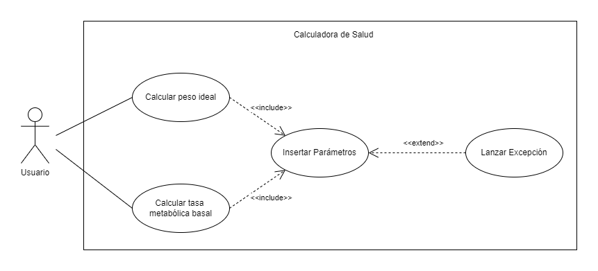
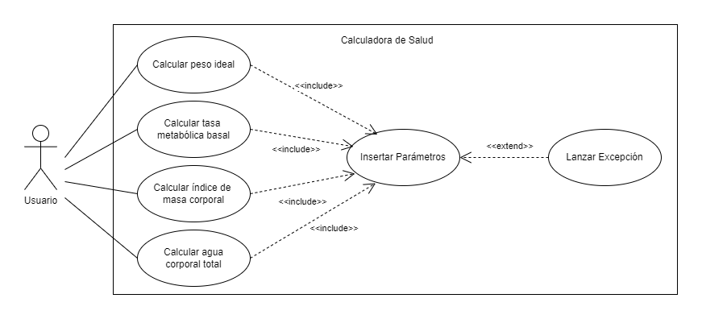

# Práctica 1 : Health calculator

En esta práctica se desarrolla una calculadora que permite estimar varios parámetros de salud de una persona, como su peso ideal o su tasa metabólica basal (TMB). La interfaz de la calculadora se ha proporcionado en el campus virtual, y se debe implementar los casos de prueba en la clase `HealthCalcTest` con JUnit5 y desarrollar una clase `HealthCalcImpl` que implemente dicha interfaz.

## Implementación de los casos de prueba de la clase HealthCalcTest

### Tests para el método idealWeight()

-   **Test de género incorrecto:** En `testGeneroIncorrectoIW()` se desea comprobar que se lanza una excepción cuando se introduce un género distinto a 'm' o 'w'. La clase `HealthCalcImpl` se ha implementando teniendo en cuenta que también se puede recibir los caracteres en mayúsculas. La excepción muestra un mensaje de género incorrecto.

-   **Test de altura incorrecta:** En `testAlturaIncorrectoIW()` se comprueba que se lanza una excepción si la altura no está entre 140cm y 250cm, ambos incluidos. Se ha establecido este rango como valores normales de altura, aunque no se haya especificado en el enunciado de la práctica. La excepción que se lanza indica que la altura es incorrecta.

-   **Test peso ideal masculino:** En `testIdealWeightM()` se comprueba que el valor que devuelve el método `idealWeight()` para una persona de género masculino corresponde con su peso ideal esperado.

-   **Test peso ideal femenino:** En `testIdealWeightW()` se comprueba que el valor que devuelve el método `idealWeight()` para una persona de género femenino corresponde con su peso ideal esperado.

### Tests para el método basalMetabolicRate()

-   **Test de género incorrecto:** En `testGeneroIncorrectoBMR()` se desea comprobar que se lanza una excepción cuando se introduce un género distinto a 'm' o 'w'. La clase `HealthCalcImpl` se ha implementando teniendo en cuenta que también se puede recibir los caracteres en mayúsculas. La excepción muestra un mensaje de género incorrecto.

-   **Test de altura incorrecta:** En `testAlturaIncorrectoBMR()` se comprueba que se lanza una excepción si la altura no está entre 140cm y 250cm, ambos incluidos. Se ha establecido este rango como valores normales de altura, aunque no se haya especificado en el enunciado de la práctica. La excepción que se lanza indica que la altura es incorrecta.

-   **Test de peso incorrecto:** En `testPesoIncorrectoBMR()` se comprueba que si el peso es menor o igual a 0kg se lanza una excepción, con un mensaje de peso incorrecto.

-   **Test de edad incorrecta:** En `testEdadIncorrectoBMR()` se desea comprobar que al insertar como edad un valor fuera del rango 0-120 años se lanza una excepción, indicando que la edad es incorrecta.

-   **Test tasa metabólica basal masculina:** En `testBasalMetabolicRateM()` se comprueba que el valor que devuelve el método `basalMetabolicRate()` para una persona de género masculino corresponde con su tasa metabólica basal esperada.

-   **Test tasa metabólica basal femenina:** En `testBasalMetabolicRateW()` se comprueba que el valor que devuelve el método `basalMetabolicRate()` para una persona de género femenino corresponde con su tasa metabólica basal esperada.

## Resultado de ejecutar los tests

Una vez implementadas las clases `HealthCalcImpl` y `HealthCalcTest` se han ejecutado los casos de prueba. En la siguiente imagen podemos observar que se pasan todos los test correctamente.

*Figura 1: Resultado al ejecutar los tests*

## Registro de instantáneas

Durante el desarrollo de la práctica se ha hecho uso de Git y se ha registrado instantáneas (commits) a medida que avanzaba el proyecto.

*Figura 2: Registro de instantáneas*

# Práctica 2 : Casos de uso

Para esta práctica se ha realizado el diagrama de casos de uso de la calculadora de salud. Primero se ha creado el diagrama para definir los casos de uso de la práctica 1 y luego, en el siguiente diagrama se ha añadido dos casos de uso más. Además, se ha especificado un caso de uso, en este caso "Calcular peso ideal".

## Diagramas de casos de uso

En este primer diagrama el actor es el usuario que utiliza la calculadora de salud. Este usuario puede calcular su peso ideal y su tasa metabólica basal. Para realizar estos cálculos, el usuario debe introducir sus datos, los cuales son los parámetros que utilizará la calculadora para obtener los resultados. Al introducir estos parámetros existe la posibilidad que se lancen excepciones si los datos no son válidos.

*Figura 3: Diagrama de casos de uso 1*

En el segundo diagrama se añade dos casos de uso más al anterior diagrama. Los casos de uso son los siguientes:

-   **Calcular índice de masa corporal**: BMI = peso(kg) / altura\^2(m).
-   **Calcular agua corporal total (ATC)**:
    -   Para hombres: ACT = 2.447 − 0.09156 × edad + 0.1074 × altura(cm) + 0.3362 × peso(kg)
    -   Para mujeres: ACT = −2.097 + 0.1069 × altura(cm) + 0.2466 × peso(kg)

*Figura 4: Diagrama casos de uso 2*

## Especificación caso de uso

-   **Nombre del caso de uso:** Calcular peso ideal

-   **Stakeholders:**

    -   Usuario --\> Conocer su peso ideal
    -   Personal sanitario --\> Calcular el peso ideal de un paciente

-   **Actor principal:** Usuario

-   **Alcance (scope):** Calculadora de salud

-   **Precondición:** El usuario debe tener acceso a la calculadora de salud

-   **Garantías:**

    -   Mínimas: los datos no serán compartidos sin el consentimiento explícito del usuario
    -   De éxito: el usuario obtiene el resultado de su peso ideal

-   **Trigger:** El usuario pulsa el botón "Calcular peso ideal"

-   **Escenario principal:**

    -   1- El sistema solicita los parámetros necesarios

    -   2- El usuario introduce los datos

    -   3- El sistema valida los datos

    -   4- El sistema calcula el peso ideal

    -   5- El sistema muestra el resultado

-   **Escenario alternativo:**

    -   2b- El usuario introduce valores no válidos
        -   2b1- El sistema muestra un mensaje de error y vuelve al paso 1

# Práctica 3 : BDD

Durante esta práctica se ha definido dos historias de usuario con dos escenarios cada una para la calculadora de salud.

## Historia de usuario 1: Cálculo del peso ideal de una persona.

-   As a [usuario de la calculadora]
-   I want [calcular mi peso ideal]
-   So that [alcanzar un peso saludable]

**Criterios de aceptación:**

-   **Escenario 1:** Los parámetros para calcular el peso ideal son válidos.

    -   Given [un usuario de HealthCalc]
    -   When [el usuario introduce valores válidos para su altura y género]
    -   Then [el sistema devuelve el valor del peso ideal]

-   **Escenario 2:** Los parámetros para calcular el peso ideal son incorrectos.

    -   Given [un usuario de HealthCalc]
    -   When [el usuario introduce valores incorrectos para su altura y género]
    -   Then [el sistema devuelve un mensaje de error con la altura o género incorrecto]

## Historia de usuario 2: Cálculo de la tasa metabólica basal de una persona.

-   As a [usuario de la calculadora]
-   I want [calcular mi tasa metabólica basal]
-   So that [planificar mi dieta con la cantidad adecuada de calorías]

**Criterios de aceptación:**

-   **Escenario 1:** Los parámetros para calcular la tasa metabólica basal son válidos.

    -   Given [un usuario de HealthCalc]
    -   When [el usuario introduce valores válidos para su altura, género, peso y edad]
    -   Then [el sistema devuelve el valor de la tasa metabólica basal]

-   **Escenario 2:** Los parámetros para calcular la tasa metabólica basal son incorrectos.

    -   Given [un usuario de HealthCalc]
    -   When [el usuario introduce valores incorrectos para su altura, género, peso y edad]
    -   Then [el sistema devuelve un mensaje de error con los parámetros que son incorrectos]
