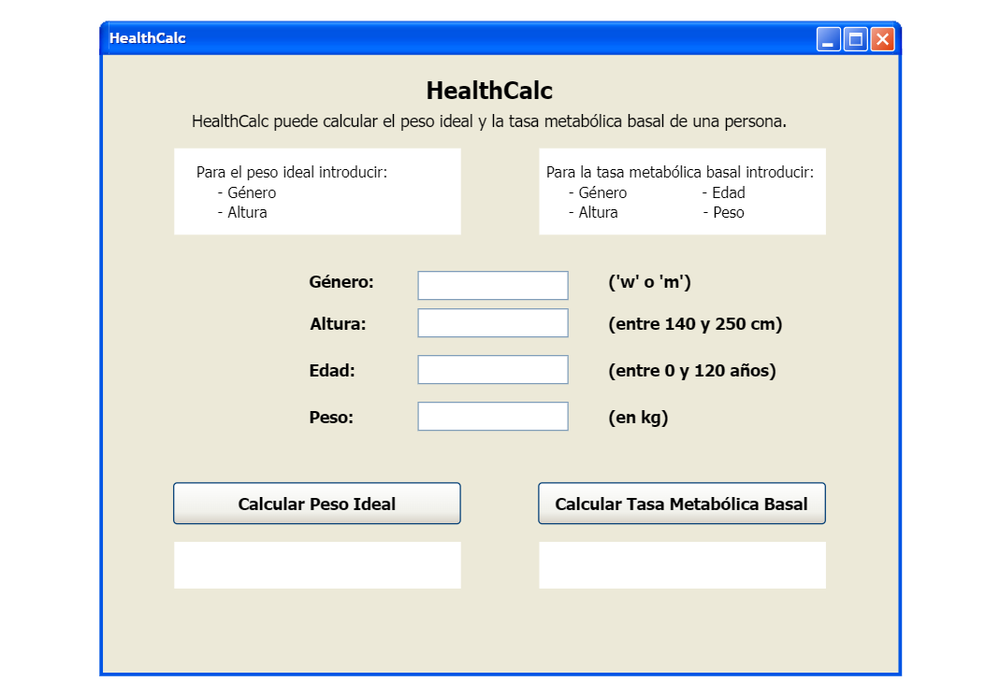
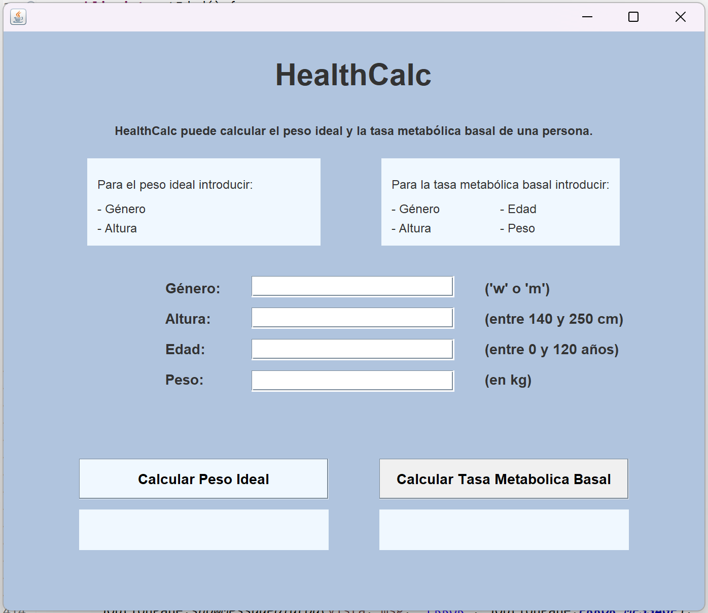
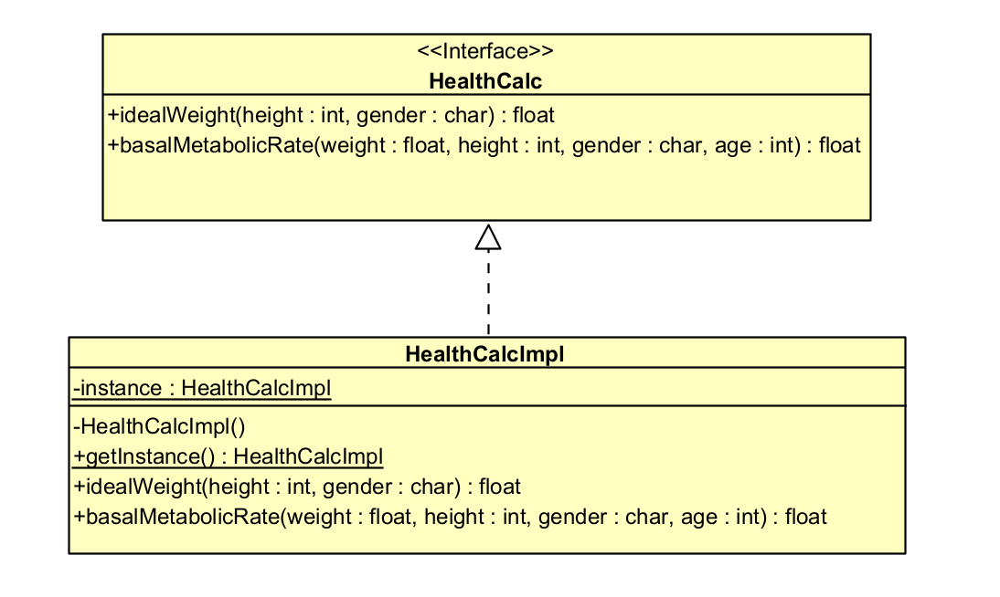
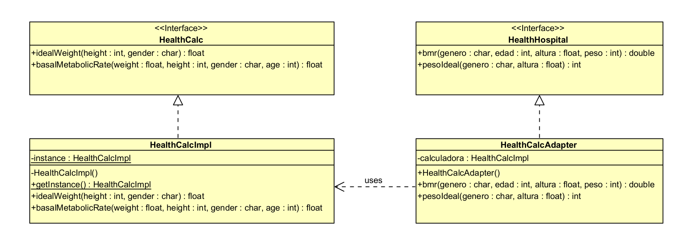
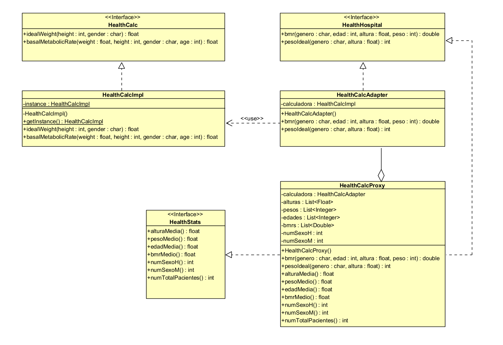
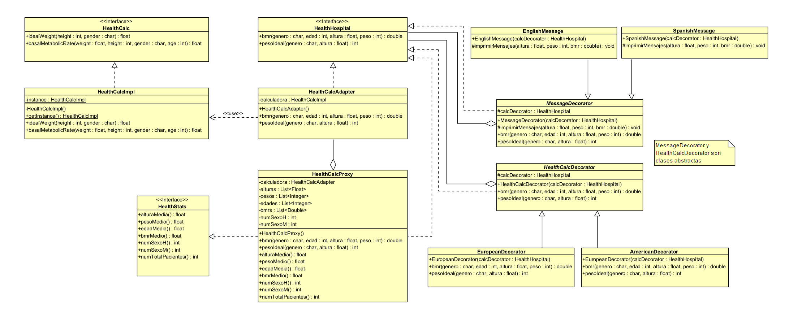

# Práctica 1 : Health calculator

En esta práctica se desarrolla una calculadora que permite estimar varios parámetros de salud de una persona, como su peso ideal o su tasa metabólica basal (TMB). La interfaz de la calculadora se ha proporcionado en el campus virtual, y se debe implementar los casos de prueba en la clase `HealthCalcTest` con JUnit5 y desarrollar una clase `HealthCalcImpl` que implemente dicha interfaz.

## Implementación de los casos de prueba de la clase HealthCalcTest

### Tests para el método idealWeight()

-   **Test de género incorrecto:** En `testGeneroIncorrectoIW()` se desea comprobar que se lanza una excepción cuando se introduce un género distinto a 'm' o 'w'. La clase `HealthCalcImpl` se ha implementando teniendo en cuenta que también se puede recibir los caracteres en mayúsculas. La excepción muestra un mensaje de género incorrecto.

-   **Test de altura incorrecta:** En `testAlturaIncorrectoIW()` se comprueba que se lanza una excepción si la altura no está entre 140cm y 250cm, ambos incluidos. Se ha establecido este rango como valores normales de altura, aunque no se haya especificado en el enunciado de la práctica. La excepción que se lanza indica que la altura es incorrecta.

-   **Test peso ideal masculino:** En `testIdealWeightM()` se comprueba que el valor que devuelve el método `idealWeight()` para una persona de género masculino corresponde con su peso ideal esperado.

-   **Test peso ideal femenino:** En `testIdealWeightW()` se comprueba que el valor que devuelve el método `idealWeight()` para una persona de género femenino corresponde con su peso ideal esperado.

### Tests para el método basalMetabolicRate()

-   **Test de género incorrecto:** En `testGeneroIncorrectoBMR()` se desea comprobar que se lanza una excepción cuando se introduce un género distinto a 'm' o 'w'. La clase `HealthCalcImpl` se ha implementando teniendo en cuenta que también se puede recibir los caracteres en mayúsculas. La excepción muestra un mensaje de género incorrecto.

-   **Test de altura incorrecta:** En `testAlturaIncorrectoBMR()` se comprueba que se lanza una excepción si la altura no está entre 140cm y 250cm, ambos incluidos. Se ha establecido este rango como valores normales de altura, aunque no se haya especificado en el enunciado de la práctica. La excepción que se lanza indica que la altura es incorrecta.

-   **Test de peso incorrecto:** En `testPesoIncorrectoBMR()` se comprueba que si el peso es menor o igual a 0kg se lanza una excepción, con un mensaje de peso incorrecto.

-   **Test de edad incorrecta:** En `testEdadIncorrectoBMR()` se desea comprobar que al insertar como edad un valor fuera del rango 0-120 años se lanza una excepción, indicando que la edad es incorrecta.

-   **Test tasa metabólica basal masculina:** En `testBasalMetabolicRateM()` se comprueba que el valor que devuelve el método `basalMetabolicRate()` para una persona de género masculino corresponde con su tasa metabólica basal esperada.

-   **Test tasa metabólica basal femenina:** En `testBasalMetabolicRateW()` se comprueba que el valor que devuelve el método `basalMetabolicRate()` para una persona de género femenino corresponde con su tasa metabólica basal esperada.

## Resultado de ejecutar los tests

Una vez implementadas las clases `HealthCalcImpl` y `HealthCalcTest` se han ejecutado los casos de prueba. En la siguiente imagen podemos observar que se pasan todos los test correctamente.

*Figura 1: Resultado al ejecutar los tests*

## Registro de instantáneas

Durante el desarrollo de la práctica se ha hecho uso de Git y se ha registrado instantáneas (commits) a medida que avanzaba el proyecto.

*Figura 2: Registro de instantáneas*

# Práctica 4 : Interfaces gráficas de usuario

Siguiendo con el desarrollo del proyecto HealthCalc se ha implementado una interfaz gráfica de usuario. Primero se ha diseñado un prototipo para usarlo de guía en el desarrollo de la interfaz. Posteriormente, usando *Windows Builder* para Java, se ha implementado una GUI para la calculadora siguiendo un patrón de diseño **Modelo-Vista-Controlador**.

## Diseño de un prototipo de interfaz gráfica de usuario

*Figura 3: Prototipo de interfaz gráfica de usuario*

## Desarrollo de una interfaz gráfica de usuario

*Figura 4: Interfaz gráfica de usuario*

# Práctica 5 : Evaluación de aplicaciones

En esta práctica se nos ha asignado dos aplicaciones de otros compañeros de clase. Debemos evaluar dichas aplicaciones y rellenar un formulario que recoge preguntas sobre los 10 principios generales de usabilidad (J. Nielsen).

# Práctica 6 : Patrones de diseño

Esta práctica consiste en aplicar patrones de diseño a la calculadora que ya tenemos implementada. Los patrones utilizados son los siguientes:

## Patrón Singleton (Apartado 2)

Este patrón asegura que una clase tenga una única instancia, y proporciona un punto de acceso global a esa instancia.

Se ha utilizado para instanciar la clase **HealthCalcImpl**. Este patrón garantiza que no importa cuántas veces o desde dónde se intente crear una instancia de la calculadora, siempre se utilizará la misma instancia, lo que es útil para mantener un estado consistente y controlado a través de toda la aplicación.

*Figura 5: Diagrama patrón Singleton*

## Patrón Adapter (Apartado 3A)

Permite que interfaces incompatibles trabajen juntas al convertir la interfaz de una clase en otra que los clientes esperan.

Este patrón se ha utilizado para integrar la calculadora en el sistema de un hospital. Este sistema utilizaba diferentes formatos de datos que los proporcionados por la primera implementación de la calculadora.

*Figura 6: Diagrama patrón Adapter*

## Patrón Proxy (Apartado 3B)

Proporciona un sustituto o marcador de posición para otro objeto para controlar el acceso a este. Útil para manejar operaciones costosas en la creación de objetos, o para añadir seguridad adicional, o simplemente para interceptar llamadas a métodos.

Se ha implementando con el fin de llevar un registro de las veces que se utiliza la calculadora, permitiendo obtener la media de los valores introducidos y calculados por la calculadora de todos los pacientes.

*Figura 6: Diagrama patrón Proxy*

## Patrón Decorator (Apartado 3C)

Permite añadir nuevos comportamientos a los objetos colocando estos objetos dentro de objetos envolventes especiales que contienen los comportamientos.

Se ha utilzado para adaptar los métodos de cálculo para convertir unidades de entrada y salida según las especificaciones europeas y americanas. También se ha implementado para imprimir los resultados en español e inglés.

*Figura 6: Diagrama patrón Decorator*

 
